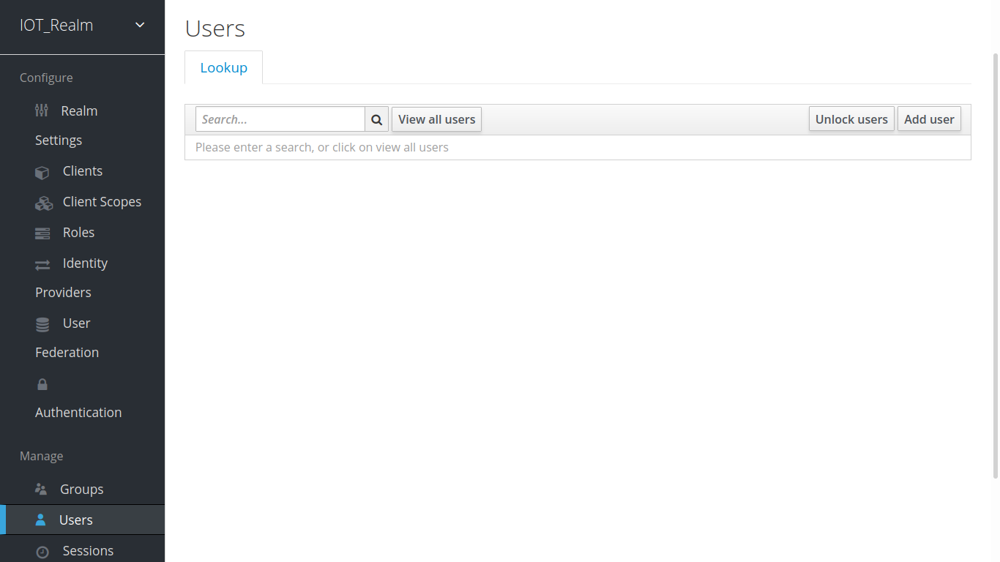
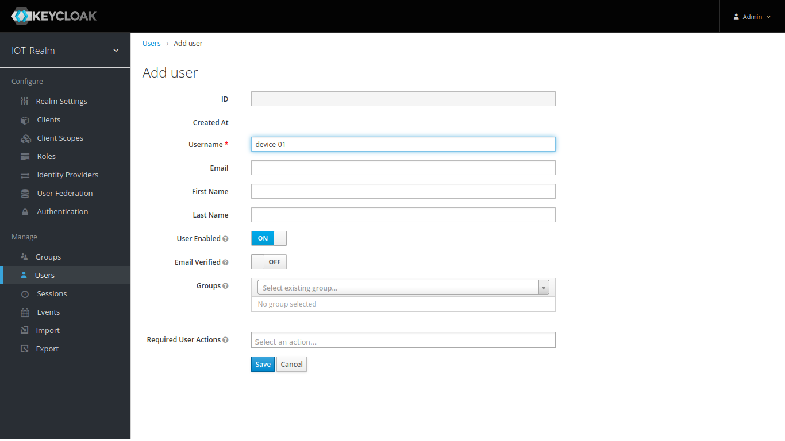
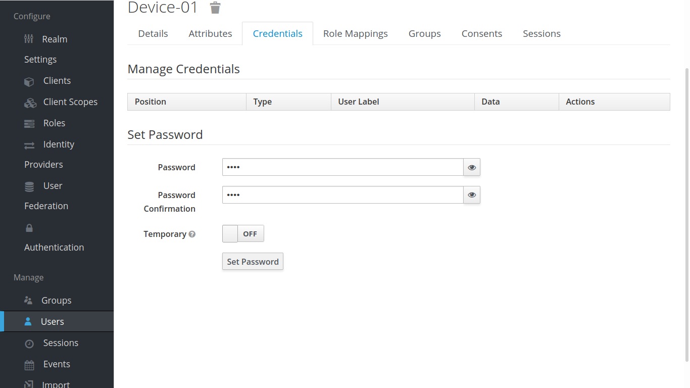

### احراز هویت و ورود یکپارچه   SSO
ابزار Single Sign On برای متمرکز کردن دسترسی ها به منابع طراحی شده است.
معمولا برای کاربران به خاطر سپردن چندین نام کاربری و رمز عبور برای دسترسی به وب‌سایت‌ها و برنامه‌های مختلفی که از آن ها استفاده می کنند دشوار است. Single Sign On که به اختصار SSO نامیده می شود یک روش احراز هویت است که به کاربران امکان می دهد تا با استفاده از یک مجموعه از اعتبار (credential) به طور ایمن به چندین منبع دسترسی داشته باشند.
در پلتفرم iocloud از ابزار قدرتمند شرکت RedHat یعنی [Keycloak](https://www.keycloak.org) استفاده شده است.

در طراحی این پلتفرم از معماری میکروسرویس استفاده شده است و کاربر می تواند متناسب با نیاز  سرویس یا app خود را توسعه دهد بدون اینکه درگیر پیچیدگی ها پلتفرم شود.

### کار با Keycloak
نرم افزار [Keycloak](https://www.keycloak.org/docs/latest/authorization_services/index.html) اپن سورس بوده و توسط یک تیم از شرکت  Redhat توسعه داده می شود.
چند مفهوم کلیدی برای کار با Keycloak می بایست با هم مرور کنیم
مفاهیم Authorization در Keycloak را در این [صفحه](https://www.keycloak.org/docs/latest/authorization_services/index.html) می توانید با جزییات مطالعه بفرمایید.
#### Realm
قلمرو یا مجدوده یک پروژه را تعیین می کند که کاربران و تنظیمات آن را از دیگر پروژه ها جدا می کند.
#### Client
منابعی که می بایست تحت حفاظت و احراز هویت در برابر آن صورت بگیرد تحت عنوان Client شناخته می شود. کاربر می تواند در صورت نیاز با اضافه کردن یک کلاینت جدید از طریق api با Keycloak برای مدیریت منابع یا اضافه نمودن سرویس جدید ارتباط برقرار کند.

در نسخه دمو IoT MQTT Broker ما از عنوان mqttbroker استفاده کردیم.
در این قسمت شما میتوانید با روش های مختلف نحوه دسترسی اشخاص و کاربران یا دستگاه به منابع را مدیریت نمایید. Keycloak از چند روش مدیریت دسترسی استفاده می نماید.

    Attribute-based access control (ABAC)

    Role-based access control (RBAC)

    User-based access control (UBAC)

    Context-based access control (CBAC)

    Rule-based access control

        Using JavaScript

    Time-based access control

    Support for custom access control mechanisms (ACMs) through a Service Provider Interface (SPI)

شما به تناسب سیاست مدیریت دسترسی می توانید از یکی از روش ها بهره بگیرید. مستندات وب سایت Keycloak با زبان نه چندان آسان سعی نموده است که نحوه کار با مدیریت دسترسی یا Authorization را توضیح دهد که در فیلم راهنمای کار با دموی پلتفرم سعی می شود به صورت عملی و کاربردی آن را توضیح دهیم.

#### User
از منو کناری به بخش کاربران وارد شده و با فشردن دگمه Add User کاربر جدید را ایجاد کنید. پس از هر تغییر اعمال شده دگمه Save را حتما فشار دهید.

Users > Add User

نام کاربری وارد شده در حقیقت همان username که در پرتکل های mqtt و ... استفاده می شود.
برای وارد کردن کلمه عبور به بخش Credintials بروید و رمز عبور را دو مرتبه وارد کنید و در انتها دگمه Temporary را غیر فعال کنید تا پلتفرم متوجه شود این پسورد دایمی است. برای ذخیره رمز عبور باید دگمه Set password را فشار دهید.

بعد از اینکه کلمه عبور ذخیره شد و دسترسی ها در قسمت Authorization ایجاد شد حالا می توانید از طریق پورت ۱۸۸۳ و از طریق پرتکل MQTTبه بروکر متصل شوید.
برای آشنایی بیشتر با مراحل و تنظیمات سرور این ویدیو را تماشا کنید.